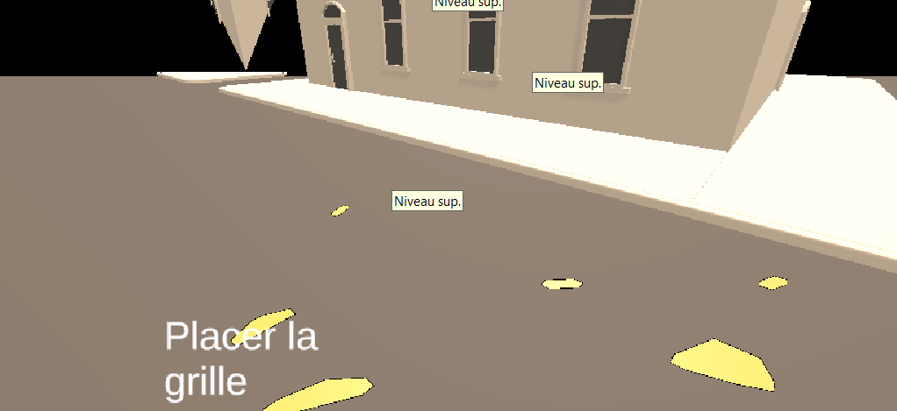
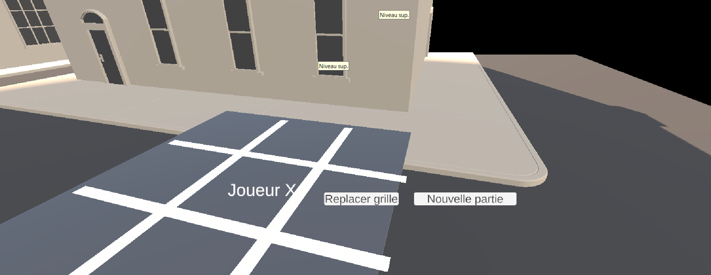
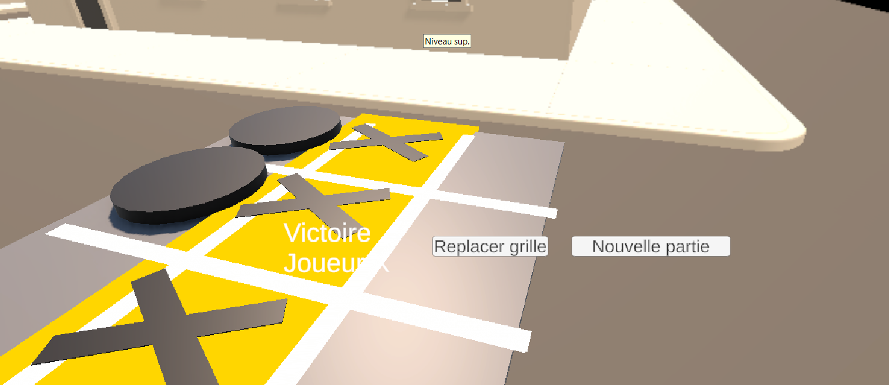

# TicTacToe - Zacharie Nolet
Le jeu de TicTacToe commence en laissant le joueur scanner un surface pour placer la grille. Un coup la grille plaçé, le joueur peut commençer à joueur aau TicTacToe en appuyant sur les cellules. Les tours des joueurs (joueur X et joueur O) sont alternatif. 

Unity version 6000.2.1f1

## Capture d'écrans :

## Défis rencontrés :

### Commment savoir si on a gagné ?
- J'ai demandé à l'IA de me montré la logique de détection des gagnants. Il m'a sortie les combinaison gagnantes :
          int[,] combinaisons =
        {
            {0,1,2},{3,4,5},{6,7,8},
            {0,3,6},{1,4,7},{2,5,8},
            {0,4,8},{2,4,6}
        };

### La détection des plans étaient difficiles.
- J'ai demandé à l'inteligence artificielle de me pister et elle m'a montré un autre moyen de détection d'un touché.
  
        if (Touchscreen.current != null && Touchscreen.current.primaryTouch.press.isPressed)
        {
            if (Touchscreen.current.primaryTouch.press.wasPressedThisFrame)
            {
                touchPosition = Touchscreen.current.primaryTouch.position.ReadValue();
                hasTouch = true;
            }
        }
        else if (Mouse.current != null && Mouse.current.leftButton.wasPressedThisFrame)
        {
            touchPosition = Mouse.current.position.ReadValue();
            hasTouch = true;
        }

        if (hasTouch)
        {
            TenterPlacement(touchPosition);
        }

### Garder en mémoire les données des symboles :
- J'ai créer une structure de données pour les symboles où je stock les données de tout les symboles instanciés.

### Animations 

- J'ai demander à l'inteligence artificielle de me montrer un exemple d'animation par code pour changer la couleur de la ligne gagnant ainsi que sa grosseur et faire un "pulse" sur les symboles lorsque je les plaçe. La solution: une méthode retournant un Ienumerator utiliser dans une coroutine.

## Requêtes utilisées :

Je veux détecter toutes les combinaisons gagnantes possibles (lignes, colonnes, diagonales) dans un Tic Tac Toe 3x3 en C#. La méthode doit vérifier si le joueur actuel occupe toutes les cases d’une combinaison et renvoyer les indices de ces cases.

Dans mon Tic Tac Toe AR, chaque cellule est un objet 3D avec une méthode AnimerVictoire(float scale). Je veux une coroutine qui prend les indices des cellules gagnantes, désactive l’interaction, anime un pulse sur ces cellules pendant quelques secondes, puis les remet à l’échelle normale.

Dans mon jeu AR Unity, je veux détecter quand le joueur touche l’écran ou clique avec la souris pour placer un objet sur un plan AR. Montre-moi le code pour récupérer la position du tap ou du clic avec le nouveau Input System.

Pistes moi sur comment à animer mes cellules gagnantes.